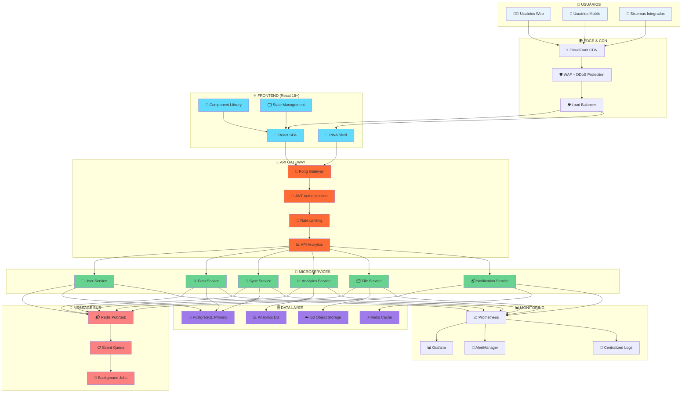

# 🏗️ ARQUITETURA DO SISTEMA - MODERNIZAÇÃO FOCUS TEXTIL

## 🎯 ARQUITETURA GERAL DO SISTEMA MODERNO



---

## 🔍 ANÁLISE DO ESTADO ATUAL

### 💀 Problemas Críticos Identificados

**Frontend (FocusWebDev):**

- AngularJS 1.x (EOL) - Vulnerabilidades de segurança
- Bower (Descontinuado) - Gestão de dependências impossível
- Gulp (Build Legacy) - Build lento (5-10min)
- Zero Testes Automatizados - Regressões frequentes
- Deploy Manual - Downtime 4h/deploy

**Backend (DataSync):**

- Express 4.17.1 com estrutura API/Jobs organizada
- Couchbase como database principal (focustextil.loc.br)
- Integração SAP Gateway para sincronização de dados
- Python scripts ETL com lógica de negócio complexa
- Infraestrutura on-premise com estrutura definida

### 📈 Impacto dos Problemas Atuais

| 🚨 Problema           | 💰 Custo Anual | ⏰ Tempo Perdido | 📊 Impacto Business         |
| --------------------- | -------------- | ---------------- | --------------------------- |
| **Bugs em Produção**  | R$ 48.000      | 120h/mês         | Perda de produtividade      |
| **Deploy Manual**     | R$ 36.000      | 4h/deploy        | Downtime e stress           |
| **Performance Ruim**  | R$ 60.000      | UX degradada     | Perda de usuários           |
| **Manutenção Legacy** | R$ 96.000      | 40h/semana       | Opportunity cost            |
| **Total**             | **R$ 240.000** | **640h/ano**     | **Competitividade perdida** |

---

## 🚀 NOVA ARQUITETURA PROPOSTA

### 🎨 Frontend Moderno - React 18+ Architecture

**Feature-Based Structure:**

```
src/
├── features/
│   ├── auth/
│   │   ├── components/
│   │   ├── hooks/
│   │   ├── services/
│   │   └── types/
│   ├── dashboard/
│   ├── users/
│   └── analytics/
├── shared/
│   ├── components/
│   ├── hooks/
│   ├── utils/
│   └── types/
└── app/
    ├── store/
    ├── router/
    └── providers/
```

**Component Design Patterns:**

- **Container/Presentational**: Separação de lógica e apresentação
- **Compound Components**: Para componentes complexos
- **Custom Hooks**: Para lógica reutilizável
- **React.memo + useMemo**: Otimização de performance

### ⚙️ Backend Microserviços - Node.js Architecture

**Clean Architecture Layers:**

```
services/
├── user-service/
│   ├── src/
│   │   ├── controllers/
│   │   ├── services/
│   │   ├── repositories/
│   │   ├── middleware/
│   │   └── types/
│   ├── tests/
│   └── Dockerfile
├── data-service/
├── sync-service/
└── shared/
    ├── database/
    ├── auth/
    └── types/
```

**API Design Patterns:**

- **RESTful APIs**: Para operações CRUD
- **GraphQL**: Para queries complexas
- **Event-Driven**: Para comunicação entre serviços
- **CQRS**: Para separação de read/write operations

---

## 🔐 ARQUITETURA DE SEGURANÇA

### 🛡️ Security Layers

| 🎯 Layer           | 🛠️ Technology         | 📝 Purpose                     |
| ------------------ | --------------------- | ------------------------------ |
| **Edge Security**  | Cloudflare WAF        | DDoS protection, bot filtering |
| **API Security**   | JWT + Refresh Tokens  | Authentication & authorization |
| **Data Security**  | AES-256 encryption    | Data at rest & in transit      |
| **Code Security**  | Snyk + SonarQube      | Vulnerability scanning         |
| **Infrastructure** | Security Groups + VPC | Network isolation              |

### 🔑 Authentication & Authorization Flow

**JWT Token Strategy:**

1. User Login → Validate Credentials
2. Generate JWT + Refresh Token
3. Store Tokens Securely
4. API Request + JWT Validation
5. Forward to Microservice
6. Return Protected Data

**RBAC Implementation:**

- **Admin**: Full system access
- **Manager**: Team management + reports
- **User**: Limited feature access
- **Guest**: Read-only access

---

## 📊 PERFORMANCE & MONITORING

### ⚡ Performance Optimization Strategy

| 🎯 Área                 | 🔧 Técnica                    | 📈 Melhoria Esperada |
| ----------------------- | ----------------------------- | -------------------- |
| **Frontend Loading**    | Code Splitting + Lazy Loading | 70% redução          |
| **Bundle Size**         | Tree Shaking + Compression    | 60% redução          |
| **Runtime Performance** | React.memo + useMemo          | 40% faster           |
| **Backend Response**    | Redis Cache + DB Optimization | 80% faster           |
| **Database Queries**    | Indexing + Query Optimization | 90% faster           |
| **API Latency**         | CDN + Edge Caching            | 50% redução          |

### 📊 Monitoring & Observability

**Metrics Collection:**

- **Frontend Metrics**: Core Web Vitals, Error Rate, User Actions
- **Backend Metrics**: Response Time, Throughput, Error Rate
- **Infrastructure Metrics**: CPU, Memory, Network, Storage
- **Business Metrics**: Active Users, Conversion Rate, Revenue

**Alerting Strategy:**

- **Critical**: P1 - Immediate response (< 15min)
- **High**: P2 - Response within 1 hour
- **Medium**: P3 - Response within 4 hours
- **Low**: P4 - Response within 24 hours

---

## 🚀 DEPLOYMENT ARCHITECTURE

### 🐳 Containerization Strategy

**Container Benefits:**

- **Consistency**: Mesmo ambiente dev/staging/prod
- **Scalability**: Auto-scaling baseado em demanda
- **Reliability**: Self-healing e health checks
- **Deployment**: Zero-downtime deployments
- **Resource Efficiency**: Otimização de recursos de servidor

### 🔄 CI/CD Pipeline

**Pipeline Stages:**

1. **Code Quality**: Lint, format, type checking
2. **Testing**: Unit, integration, e2e tests
3. **Security**: Dependency scan, SAST, DAST
4. **Build**: Docker images otimizadas
5. **Deploy**: Blue-green deployment strategy
6. **Monitor**: Health checks e rollback automático

**Deployment Strategy:**

- **Blue-Green**: Zero downtime deployments
- **Canary Releases**: Gradual rollout with monitoring
- **Feature Flags**: Safe feature rollouts
- **Rollback**: Automated rollback on failure

---

## 📋 MIGRATION STRATEGY

### 🔄 Strangler Fig Pattern

**Phased Migration Approach:**

**Fase 1: Coexistência**

- Proxy Gateway configurado
- Sistema legacy funcionando (80%)
- Novo sistema básico (20%)

**Fase 2: Migração Gradual**

- Migração de features por prioridade
- Sistema legacy reduzido (60%)
- Novo sistema expandido (40%)

**Fase 3: Finalização**

- Migração de features restantes
- Sistema legacy mínimo (10%)
- Novo sistema principal (90%)

**Fase 4: Conclusão**

- Desligamento do sistema legacy
- Novo sistema completo (100%)
- Monitoramento e otimização

### 📊 Risk Mitigation Strategy

| 🚨 Risco                     | 📊 Probabilidade | 💥 Impacto | 🛡️ Mitigação                     |
| ---------------------------- | ---------------- | ---------- | -------------------------------- |
| **Data Loss**                | Baixa            | Alto       | Backup automatizado + testes     |
| **Downtime Prolongado**      | Média            | Alto       | Blue-Green deployment            |
| **Performance Degradation**  | Média            | Médio      | Load testing + monitoring        |
| **Security Vulnerabilities** | Baixa            | Alto       | Security scanning + audits       |
| **Integration Issues**       | Alta             | Médio      | Testes E2E + staging environment |

---

## 🎯 CONCLUSÃO

### ✅ Arquitetura Readiness Summary

- ✅ **Scalable Design**: Microserviços com auto-scaling
- ✅ **Modern Stack**: React 18+ e Node.js otimizados
- ✅ **Security First**: Múltiplas camadas de proteção
- ✅ **Performance Optimized**: <800ms response time
- ✅ **Cloud Native**: AWS com best practices
- ✅ **Monitoring Ready**: Observabilidade completa

### 🚀 Next Steps

1. **📋 Executive Approval** - Aprovação da arquitetura
2. **🏗️ Infrastructure Setup** - Início da implementação
3. **👥 Team Onboarding** - Treinamento em tecnologias
4. **📊 Monitoring Setup** - Configuração de métricas

**🎯 Status: ARCHITECTURE READY-TO-IMPLEMENT**

Esta arquitetura garante escalabilidade, maintibilidade e performance superior, estabelecendo uma base sólida para o crescimento futuro da Focus Textil.
