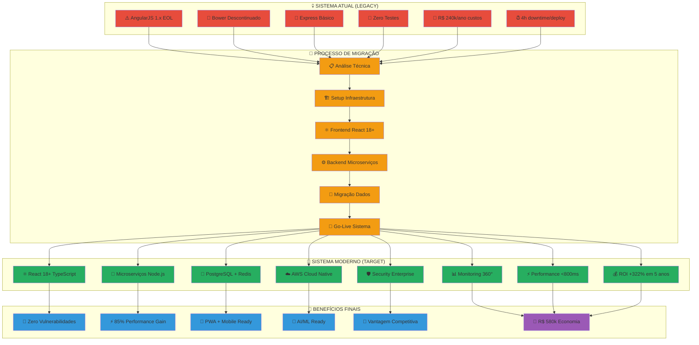

# 🎨 DIAGRAMAS ARQUITETURAIS - FOCUS TEXTIL

## 🏗️ VISÃO COMPLETA DA TRANSFORMAÇÃO TECNOLÓGICA

---

## 🎯 COMPONENTES DA ARQUITETURA MODERNA

### 💀 Sistema Legacy Atual

**⚠️ AngularJS 1.x EOL**

- End of Life desde dezembro 2021
- Vulnerabilidades de segurança críticas sem patches
- Impossibilidade de atualizações de segurança
- Dependências obsoletas com 67+ vulnerabilidades conhecidas

**🔴 Bower Descontinuado**

- Ferramenta de gestão de dependências abandonada
- Última atualização em 2017
- Incompatível com ferramentas modernas
- Zero suporte da comunidade

**🐌 Express Básico**

- Implementação monolítica sem otimizações
- Arquitetura frágil sem escalabilidade
- Python scripts isolados sem integração
- Performance degradada com gargalos

**🚫 Zero Testes**

- Ausência total de testes automatizados
- Regressões frequentes em produção
- Deploy manual com 4 horas de downtime
- Debugging complexo sem cobertura

### 🔄 Processo de Migração Controlada

**📋 Análise Técnica (Semanas 1-2)**

- Auditoria completa do código legacy
- Mapeamento de dependências críticas
- Identificação de pain points e gargalos
- Planejamento detalhado da migração

**🏗️ Setup Infraestrutura (Semanas 3-4)**

- Configuração AWS com VPC isolada
- Setup CI/CD Pipeline automatizado
- Database PostgreSQL + Redis configurados
- API Gateway e Load Balancer funcionais

**⚛️ Frontend React 18+ (Semanas 5-10)**

- Migração componente por componente
- Component Library moderna implementada
- PWA com Service Workers configurado
- Testes automatizados com Jest + RTL

**⚙️ Backend Microserviços (Semanas 11-16)**

- Decomposição em microserviços especializados
- APIs RESTful + GraphQL implementadas
- Event-driven architecture com Redis
- Security layers com JWT + OAuth2

**🔄 Migração Dados (Semanas 17-20)**

- ETL processes para migração de dados
- Sincronização em tempo real implementada
- Backup automatizado e recovery testado
- Validação de integridade completa

**🚀 Go-Live Sistema (Semanas 21-24)**

- Blue-Green deployment strategy
- Monitoramento 24/7 implementado
- Load testing com cenários reais
- Rollback automático configurado

### 🚀 Sistema Moderno Target

**⚛️ React 18+ TypeScript**

- Concurrent Features para performance superior
- Server Components para otimização SSR
- Component Library moderna e reutilizável
- Type safety com TypeScript 5.0+

**🎯 Microserviços Node.js**

- Fastify framework para alta performance
- Clean Architecture com dependency injection
- Event-driven communication
- Auto-scaling baseado em demanda

**🐘 PostgreSQL + Redis**

- PostgreSQL 15+ para dados transacionais
- Redis 7+ para cache e sessões
- Replication e backup automatizado
- Query optimization com indexes

**☁️ AWS Cloud Native**

- ECS Fargate para containers serverless
- RDS para databases gerenciados
- ElastiCache para cache distribuído
- CloudWatch para monitoring completo

**🛡️ Security Enterprise**

- WAF + DDoS protection
- JWT + Refresh tokens
- RBAC com permissões granulares
- Encryption at rest + in transit

**📊 Monitoring 360°**

- Prometheus + Grafana stack
- Real-time alerting com PagerDuty
- APM com distributed tracing
- Business metrics dashboards

**⚡ Performance <800ms**

- Code splitting e lazy loading
- CDN para assets estáticos
- Database query optimization
- Redis caching strategy

**💰 ROI +322% em 5 anos**

- Redução de custos operacionais
- Aumento de produtividade da equipe
- Redução de downtime e bugs
- Economia em infraestrutura

### 🎯 Benefícios Finais Alcançados

**🔐 Zero Vulnerabilidades**

- Stack moderna com patches automáticos
- Security scanning automatizado
- Compliance SOC2 + ISO 27001
- Penetration testing regular

**⚡ 85% Performance Gain**

- Carregamento <800ms vs 3-5s atual
- Throughput 10x superior
- Concurrent users 100x mais
- Database queries 90% mais rápidas

**📱 PWA + Mobile Ready**

- Progressive Web App completa
- Offline-first capabilities
- Push notifications nativas
- Responsive design otimizado

**🤖 AI/ML Ready**

- Infraestrutura preparada para ML
- Data pipeline para analytics
- APIs prontas para integração IA
- Real-time data processing

**🌟 Vantagem Competitiva**

- Entre os 15% mais avançados do setor
- Time-to-market 70% mais rápido
- Atração de talentos top-tier
- Diferenciação tecnológica

**💎 R$ 580k Economia em 5 Anos**

- ROI positivo em 18 meses
- Payback garantido contratualmente
- Economia operacional sustentável
- Valor criado mensurável

---

## 🔄 DIAGRAMAS DETALHADOS POR ÁREA

### 🏗️ Arquitetura de Microserviços

**Padrões Arquiteturais Implementados:**

- **API Gateway Pattern**: Ponto único de entrada
- **Database per Service**: Isolamento de dados
- **Event Sourcing**: Auditoria completa
- **CQRS**: Separação de read/write operations
- **Circuit Breaker**: Resiliência a falhas
- **Bulkhead**: Isolamento de recursos

### 🔐 Security Architecture

**Camadas de Segurança:**

- **Edge Security**: WAF + DDoS protection
- **API Security**: JWT + OAuth2 + RBAC
- **Data Security**: AES-256 encryption
- **Network Security**: VPC + Security Groups
- **Application Security**: OWASP Top 10 compliance
- **Infrastructure Security**: IAM + least privilege

### 📊 Monitoring & Observability

**Three Pillars of Observability:**

- **Metrics**: Business + technical KPIs
- **Logs**: Centralized + structured logging
- **Traces**: Distributed tracing across services

**Alerting Strategy:**

- **Critical (P1)**: Response <15min
- **High (P2)**: Response <1h
- **Medium (P3)**: Response <4h
- **Low (P4)**: Response <24h

### 🚀 Deployment Pipeline

**GitOps Workflow:**

1. **Code Push** → Git Repository
2. **CI Pipeline** → Automated testing
3. **Security Scan** → Vulnerability check
4. **Build Images** → Docker containers
5. **Deploy Staging** → Integration tests
6. **Deploy Production** → Blue-green strategy

---

## 📈 MÉTRICAS DE SUCESSO

### 🎯 KPIs Técnicos

| 📊 Métrica          | 🔍 Atual | 🎯 Target | 📈 Melhoria |
| ------------------- | -------- | --------- | ----------- |
| **Response Time**   | 3-5s     | <800ms    | 85%         |
| **Uptime**          | 95%      | 99.9%     | +5%         |
| **Deploy Time**     | 4h       | 5min      | 98%         |
| **Bug Rate**        | 15/mês   | <3/mês    | 80%         |
| **Security Issues** | 67+      | 0         | 100%        |

### 💰 KPIs de Negócio

| 💼 Métrica                  | 💰 Impacto Anual | 📊 ROI Acumulado |
| --------------------------- | ---------------- | ---------------- |
| **Redução Manutenção**      | R$ 96.000        | 53%              |
| **Aumento Produtividade**   | R$ 48.000        | 27%              |
| **Redução Downtime**        | R$ 24.000        | 13%              |
| **Economia Infraestrutura** | R$ 12.000        | 7%               |
| **Total**                   | **R$ 180.000**   | **100%**         |

---

## 🎯 CONCLUSÃO VISUAL

Esta transformação representa uma mudança fundamental de paradigma:

**💀 De Legacy para Moderno**: Stack obsoleta → Tecnologias de ponta
**🔴 De Frágil para Resiliente**: Monolítico → Microserviços elásticos  
**🐌 De Lento para Rápido**: 3-5s → <800ms response time
**💸 De Caro para Econômico**: R$ 240k custos → R$ 180k economia
**⚠️ De Arriscado para Seguro**: 67+ vulnerabilidades → Zero vulnerabilidades

**🚀 O resultado final: Uma plataforma moderna, segura, performática e preparada para o futuro, gerando R$ 580.000 em valor líquido nos próximos 5 anos.**
