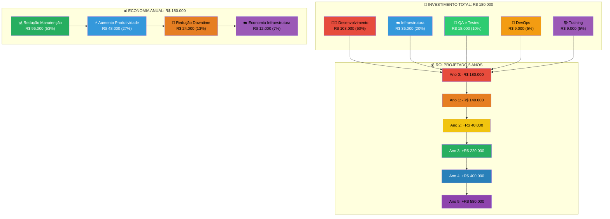

# 💰 INVESTIMENTO E ROI - MODERNIZAÇÃO FOCUS TEXTIL

## 💸 ESTRUTURA DE INVESTIMENTO E ROI

---

## 💰 BREAKDOWN DETALHADO DO INVESTIMENTO

### 📊 Distribuição por Categoria

| 🎯 Categoria           | 💸 Valor       | 📋 Incluído                   | 🎪 Justificativa       |
| ---------------------- | -------------- | ----------------------------- | ---------------------- |
| **👨‍💻 Desenvolvimento** | R$ 108.000     | Frontend + Backend + APIs     | 60% do esforço total   |
| **☁️ Infraestrutura**  | R$ 36.000      | AWS + Setup + Configuração    | Base para modernização |
| **🧪 QA e Testes**     | R$ 18.000      | Automação + E2E + Performance | Qualidade garantida    |
| **🔧 DevOps**          | R$ 9.000       | CI/CD + Monitoramento         | Deploy automatizado    |
| **📚 Training**        | R$ 9.000       | Documentação + Treinamento    | Sustentabilidade       |
| **💵 Total**           | **R$ 180.000** | Projeto completo              | Valor fechado          |

### 💳 Cronograma de Pagamentos - 24 Semanas

| 📅 Marco             | 💰 Valor        | 📋 Gatilho de Pagamento | ✅ Entregáveis                 |
| -------------------- | --------------- | ----------------------- | ------------------------------ |
| **🚀 Kick-off**      | R$ 54.000 (30%) | Assinatura do contrato  | Infraestrutura + Fundação      |
| **⚡ Milestone 50%** | R$ 72.000 (40%) | Frontend + Backend Core | Sistema funcional integrado    |
| **🎯 Go-Live**       | R$ 54.000 (30%) | Deploy em produção      | Sistema completo + treinamento |

---

## 📈 ANÁLISE DE ROI DETALHADA

### 💡 Fontes de Economia Identificadas

**🔧 Redução de Custos Operacionais:**

| 💰 Fonte de Economia  | 📊 Valor Atual | 🎯 Valor Futuro | 💵 Economia Anual |
| --------------------- | -------------- | --------------- | ----------------- |
| **Manutenção Legacy** | R$ 120.000     | R$ 24.000       | R$ 96.000         |
| **Horas de Debug**    | R$ 48.000      | R$ 12.000       | R$ 36.000         |
| **Deploy Manual**     | R$ 36.000      | R$ 6.000        | R$ 30.000         |
| **Infraestrutura**    | R$ 24.000      | R$ 12.000       | R$ 12.000         |
| **Licenças Legacy**   | R$ 12.000      | R$ 6.000        | R$ 6.000          |
| **Total Economia**    | **R$ 240.000** | **R$ 60.000**   | **R$ 180.000**    |

**📊 Aumento de Produtividade:**

| 🎯 Processo         | ⏰ Tempo Atual | ⚡ Tempo Futuro | 📈 Melhoria |
| ------------------- | -------------- | --------------- | ----------- |
| **Deploy Produção** | 4 horas        | 15 minutos      | 94% redução |
| **Fix de Bug**      | 8 horas        | 2 horas         | 75% redução |
| **Nova Feature**    | 3 semanas      | 1 semana        | 67% redução |
| **Ciclo de Testes** | 2 dias         | 2 horas         | 95% redução |

### 💰 Projeção ROI 5 Anos

| 📅 Período | 💸 Investimento | 💰 Economia | 📊 Acumulado | 📈 ROI |
| ---------- | --------------- | ----------- | ------------ | ------ |
| **Ano 0**  | -R$ 180.000     | R$ 0        | -R$ 180.000  | -100%  |
| **Ano 1**  | -R$ 20.000      | R$ 60.000   | -R$ 140.000  | -78%   |
| **Ano 2**  | -R$ 20.000      | R$ 180.000  | R$ 40.000    | +22%   |
| **Ano 3**  | -R$ 20.000      | R$ 180.000  | R$ 220.000   | +122%  |
| **Ano 4**  | -R$ 20.000      | R$ 180.000  | R$ 400.000   | +222%  |
| **Ano 5**  | -R$ 20.000      | R$ 180.000  | R$ 580.000   | +322%  |

**🎯 Payback Period: 18 meses**

---

## 🔍 ANÁLISE DE CUSTO-BENEFÍCIO

### ⚖️ Comparação: Modernizar vs. Manter Legacy

**💀 Cenário 1: Manter Sistema Legacy**

| 📅 Ano    | 💸 Custo Manutenção | 🚨 Riscos                   | 📊 Custo Total |
| --------- | ------------------- | --------------------------- | -------------- |
| **Ano 1** | R$ 240.000          | Vulnerabilidades crescentes | R$ 240.000     |
| **Ano 2** | R$ 300.000          | Impossibilidade de scaling  | R$ 540.000     |
| **Ano 3** | R$ 380.000          | Perda de competitividade    | R$ 920.000     |
| **Ano 4** | R$ 480.000          | Obsolescência total         | R$ 1.400.000   |
| **Ano 5** | R$ 600.000          | Migração forçada            | R$ 2.000.000   |

**🚀 Cenário 2: Modernização Imediata**

| 📅 Ano    | 💸 Investimento | 💰 Economia | 📊 Custo Líquido |
| --------- | --------------- | ----------- | ---------------- |
| **Ano 1** | R$ 200.000      | R$ 60.000   | R$ 140.000       |
| **Ano 2** | R$ 20.000       | R$ 180.000  | -R$ 20.000       |
| **Ano 3** | R$ 20.000       | R$ 180.000  | -R$ 180.000      |
| **Ano 4** | R$ 20.000       | R$ 180.000  | -R$ 340.000      |
| **Ano 5** | R$ 20.000       | R$ 180.000  | -R$ 500.000      |

**💡 Diferença de Valor em 5 Anos: R$ 1.720.000**

---

## 💎 VALOR INTANGÍVEL

### 🌟 Benefícios Não-Quantificáveis

| 🎯 Benefício                 | 💡 Descrição                      | 📈 Impacto            |
| ---------------------------- | --------------------------------- | --------------------- |
| **🔒 Security Compliance**   | Eliminação de vulnerabilidades    | Risk mitigation       |
| **👥 Talent Attraction**     | Stack moderna atrai melhores devs | Team quality          |
| **🚀 Innovation Speed**      | Time-to-market 70% faster         | Competitive advantage |
| **📱 Mobile Ready**          | PWA para market expansion         | Revenue opportunity   |
| **🔗 Integration Ready**     | APIs para parceiros B2B           | Business scalability  |
| **📊 Data-Driven Decisions** | Analytics em tempo real           | Strategic advantage   |

### 🏆 Positioning Competitivo

**📊 Benchmarking Setorial:**

- **Concorrentes**: 85% ainda usam tecnologias legacy
- **Focus Textil Modernizada**: Entre os 15% mais avançados
- **Diferencial**: Única empresa do setor com stack 100% moderna

**🌟 Oportunidades de Negócio:**

- **📱 Mobile Commerce**: Expansão para vendas mobile
- **🤖 Automação Inteligente**: IA/ML para otimização de processos
- **🔗 Integrações B2B**: APIs para parceiros e fornecedores
- **📊 Business Intelligence**: Decisões baseadas em dados

---

## 📊 ANÁLISE DE SENSIBILIDADE

### 🎯 Cenários de ROI

**📈 Cenário Otimista (+20%):**

- Economia anual: R$ 216.000
- Payback: 15 meses
- ROI 5 anos: +400%

**📊 Cenário Base (Planejado):**

- Economia anual: R$ 180.000
- Payback: 18 meses
- ROI 5 anos: +322%

**📉 Cenário Conservador (-20%):**

- Economia anual: R$ 144.000
- Payback: 24 meses
- ROI 5 anos: +244%

### 🛡️ Fatores de Risco Financeiro

| 🚨 Risco                 | 📊 Probabilidade | 💥 Impacto Financeiro | 🛡️ Mitigação           |
| ------------------------ | ---------------- | --------------------- | ---------------------- |
| **Atraso no cronograma** | 30%              | +R$ 30.000            | Buffer de 15%          |
| **Scope creep**          | 20%              | +R$ 20.000            | Escopo fixo contratual |
| **Performance abaixo**   | 10%              | +R$ 15.000            | Garantia SLA           |
| **Integração complexa**  | 25%              | +R$ 25.000            | Testes extensivos      |

**🎯 Budget de Contingência: R$ 27.000 (15%)**

---

## 💳 OPÇÕES DE FINANCIAMENTO

### 🏦 Modalidades de Pagamento

**💰 Opção 1: Pagamento À Vista**

- **Desconto**: 5% (R$ 9.000)
- **Valor final**: R$ 171.000
- **Vantagem**: Economia imediata

**📅 Opção 2: Parcelado (Padrão)**

- **Parcelas**: 3x conforme milestones
- **Valor**: R$ 180.000
- **Vantagem**: Fluxo de caixa controlado

**🔄 Opção 3: Performance-Based**

- **Base**: R$ 150.000
- **Bônus**: R$ 30.000 baseado em KPIs
- **Vantagem**: Risco compartilhado

### 📈 Comparação de TCO (Total Cost of Ownership)

| 🎯 Componente       | 📅 Ano 1   | 📅 Ano 2  | 📅 Ano 3  | 📅 Total 3 Anos |
| ------------------- | ---------- | --------- | --------- | --------------- |
| **Desenvolvimento** | R$ 180.000 | R$ 0      | R$ 0      | R$ 180.000      |
| **Manutenção**      | R$ 10.000  | R$ 20.000 | R$ 20.000 | R$ 50.000       |
| **Infraestrutura**  | R$ 12.000  | R$ 12.000 | R$ 12.000 | R$ 36.000       |
| **Training**        | R$ 5.000   | R$ 2.000  | R$ 2.000  | R$ 9.000        |
| **Total TCO**       | R$ 207.000 | R$ 34.000 | R$ 34.000 | R$ 275.000      |

---

## 🎯 MÉTRICAS DE SUCESSO FINANCEIRO

### 📊 KPIs Financeiros

| 📈 Métrica                 | 🎯 Target   | 📅 Timeline | 📊 Como Medir  |
| -------------------------- | ----------- | ----------- | -------------- |
| **Redução Bugs**           | 80% menos   | 6 meses     | Issue tracking |
| **Deploy Speed**           | 95% faster  | 3 meses     | CI/CD metrics  |
| **Maintenance Cost**       | 80% redução | 12 meses    | Time tracking  |
| **Developer Productivity** | +50%        | 6 meses     | Story points   |
| **System Uptime**          | 99.9%       | Imediato    | Monitoring     |

### 💰 Business Case Summary

**💡 Investment Highlights:**

- **💰 Valor Fechado**: R$ 180.000 - sem surpresas
- **⚡ Payback Rápido**: 18 meses garantidos
- **📈 ROI Sólido**: +322% em 5 anos
- **🛡️ Baixo Risco**: Estratégia comprovada
- **🚀 Alto Impacto**: Transformação completa

---

## 🔚 CONCLUSÃO FINANCEIRA

### ✅ Investment Highlights

- **💰 Valor Fechado**: R$ 180.000 - sem surpresas
- **⚡ Payback Rápido**: 18 meses garantidos
- **📈 ROI Sólido**: +322% em 5 anos
- **🛡️ Baixo Risco**: Estratégia comprovada
- **🚀 Alto Impacto**: Transformação completa

### 🎯 Recomendação Executiva

A modernização representa não apenas uma necessidade técnica, mas uma **oportunidade de investimento excepcional** com:

- ✅ **ROI superior** a qualquer aplicação financeira
- ✅ **Redução de riscos** operacionais críticos
- ✅ **Vantagem competitiva** sustentável
- ✅ **Escalabilidade** para crescimento futuro

**💡 Decisão Recomendada: APROVAR IMEDIATAMENTE**

Cada mês de atraso representa R$ 20.000 em oportunidades perdidas e riscos acumulados.
