# 🔄 ESTRATÉGIA DE MIGRAÇÃO - FOCUS TEXTIL

## 🎯 ESTRATÉGIA STRANGLER FIG PATTERN

```mermaid
graph TB
subgraph "📅 FASE 1: COEXISTÊNCIA"
A1["👥 Usuários"]
B1["🚪 Smart Proxy"]
C1["💀 Sistema Legacy (80%)"]
D1["🆕 Novo Sistema (20%)"]
end

subgraph "📅 FASE 2: MIGRAÇÃO GRADUAL"
A2["👥 Usuários"]
B2["🚪 Smart Proxy"]
C2["💀 Sistema Legacy (60%)"]
D2["🆕 Novo Sistema (40%)"]
end

subgraph "📅 FASE 3: FINALIZAÇÃO"
A3["👥 Usuários"]
B3["🚪 Smart Proxy"]
C3["💀 Sistema Legacy (10%)"]
D3["🆕 Novo Sistema (90%)"]
end

subgraph "📅 FASE 4: CONCLUSÃO"
A4["👥 Usuários"]
B4["🚪 API Gateway"]
D4["🆕 Sistema Moderno (100%)"]
end

A1 --> B1
B1 -->|80%| C1
B1 -->|20%| D1

A2 --> B2
B2 -->|60%| C2
B2 -->|40%| D2

A3 --> B3
B3 -->|10%| C3
B3 -->|90%| D3

A4 --> B4
B4 -->|100%| D4

style C1 fill:#ffcccc,color:#000000
style C2 fill:#ffcccc,color:#000000
style C3 fill:#ffcccc,color:#000000
style D1 fill:#ccffcc,color:#000000
style D2 fill:#ccffcc,color:#000000
style D3 fill:#ccffcc,color:#000000
style D4 fill:#ccffcc,color:#000000
style B1 fill:#ffffcc,color:#000000
style B2 fill:#ffffcc,color:#000000
style B3 fill:#ffffcc,color:#000000
style B4 fill:#ccffcc,color:#000000
```

---

## 📊 ANÁLISE DO ESTADO ATUAL

### 💀 Inventário Tecnológico Completo

**📱 Frontend (FocusWebDev-salesforce_fnt):**

- AngularJS 1.8.2 (EOL desde 2021)
- Bower (Descontinuado desde 2017)
- Gulp (Build system legado)
- 67+ Dependências vulneráveis
- Zero testes automatizados
- Deploy manual com 4h downtime
- Performance score <2/10
- Mobile experience ruim

**⚙️ Backend (DataSync):**

- Express 4.17.1 básico
- Arquitetura monolítica
- Python scripts isolados
- Sem autenticação robusta
- Zero documentação API
- Logs rudimentares
- Sem monitoramento
- Performance não otimizada

### 📈 Impacto dos Problemas Atuais

| 🚨 Problema           | 💰 Custo Anual | ⏰ Tempo Perdido | 📊 Impacto Business         |
| --------------------- | -------------- | ---------------- | --------------------------- |
| **Bugs em Produção**  | R$ 48.000      | 120h/mês         | Perda de produtividade      |
| **Deploy Manual**     | R$ 36.000      | 4h/deploy        | Downtime e stress           |
| **Performance Ruim**  | R$ 60.000      | UX degradada     | Perda de usuários           |
| **Manutenção Legacy** | R$ 96.000      | 40h/semana       | Opportunity cost            |
| **Total**             | **R$ 240.000** | **640h/ano**     | **Competitividade perdida** |

---

## 📅 ROADMAP DETALHADO - 24 SEMANAS

### 🗓️ Cronograma Executivo

**🏗️ FASE 1: FUNDAÇÃO (Semanas 1-4)**

- Setup Infraestrutura AWS + VPC
- CI/CD Pipeline com GitHub Actions
- Database PostgreSQL + Redis configurados
- Proxy Gateway funcionando com legacy

**⚛️ FASE 2: FRONTEND CORE (Semanas 5-10)**

- React 18+ Architecture setup
- Component Library desenvolvimento
- Sistema de autenticação migrado
- Core pages migradas gradualmente

**⚙️ FASE 3: BACKEND SERVICES (Semanas 11-16)**

- User Service desenvolvimento
- Data Service + APIs RESTful
- Sync Service para integração
- Analytics Service implementado

**🔄 FASE 4: INTEGRAÇÃO (Semanas 17-20)**

- Data migration completa
- E2E testing comprehensive
- Performance tuning
- System integration final

**🚀 FASE 5: GO-LIVE (Semanas 21-24)**

- Blue-green deployment
- Monitoring setup completo
- Legacy system retirement
- Team training e handover

### 📊 Milestones Críticos

| 📅 Semana | 🎯 Marco              | 📋 Critério de Aceite              |
| --------- | --------------------- | ---------------------------------- |
| **4**     | Infraestrutura Pronta | Deploy automatizado funcionando    |
| **10**    | Frontend MVP          | Primeira experiência melhorada     |
| **16**    | Backend Funcional     | Integração completa dos sistemas   |
| **20**    | Sistema Integrado     | Funcionalidade completa disponível |
| **24**    | Go-Live               | Modernização completa em produção  |

---

## 🔄 DETALHAMENTO POR FASE

### 🏗️ FASE 1: FUNDAÇÃO (Semanas 1-4)

**Objetivos Críticos:**

- ✅ Infraestrutura cloud configurada
- ✅ CI/CD pipeline funcional
- ✅ Database estruturado
- ✅ Proxy gateway configurado

**Setup Técnico Detalhado:**

- **AWS Infrastructure**: VPC + Subnets + Security Groups
- **EKS Cluster**: Kubernetes para orquestração
- **RDS PostgreSQL**: Database principal otimizado
- **ElastiCache Redis**: Cache e pub/sub
- **S3 Buckets**: Object storage para arquivos
- **GitHub Actions**: CI/CD pipeline automatizado

### ⚛️ FASE 2: FRONTEND CORE (Semanas 5-10)

**Component Migration Priority:**

| 🎯 Prioridade    | 📋 Componente       | 📅 Semana | 💡 Justificativa         |
| ---------------- | ------------------- | --------- | ------------------------ |
| **P0 - Crítico** | Sistema de Login    | 6         | Autenticação é base      |
| **P1 - Alto**    | Dashboard Principal | 7-8       | Primeira impressão       |
| **P2 - Médio**   | Formulários Core    | 8-9       | Funcionalidade principal |
| **P3 - Normal**  | Relatórios          | 9-10      | Features secundárias     |

**Component Library Strategy:**

- Design Tokens para consistência visual
- Base Components reutilizáveis
- Page Templates para produtividade
- Feature Modules para organização

### ⚙️ FASE 3: BACKEND SERVICES (Semanas 11-16)

**Microservices Development:**

| 🔌 Service       | 📋 Endpoints             | 🎯 Purpose                       | 📊 Priority |
| ---------------- | ------------------------ | -------------------------------- | ----------- |
| **User Service** | /auth/_, /users/_        | Authentication & user management | P0          |
| **Data Service** | /data/_, /sync/_         | Core business data               | P0          |
| **Analytics**    | /analytics/_, /reports/_ | Business intelligence            | P1          |
| **File Service** | /files/_, /upload/_      | Document management              | P2          |

**API Design Strategy:**

- RESTful APIs para operações CRUD
- GraphQL para queries complexas
- Event-driven para comunicação entre serviços
- OpenAPI para documentação automática

### 🔄 FASE 4: INTEGRAÇÃO (Semanas 17-20)

**Data Migration Strategy:**

1. **Data Audit**: Análise e validação de dados legados
2. **Data Cleansing**: Limpeza e normalização
3. **ETL Process**: Extract, Transform, Load
4. **Validation**: Testes de integridade
5. **Go-Live**: Migração final para produção

**Testing Strategy Comprehensive:**

- **Unit Tests (80%+)**: Code quality assurance
- **Integration Tests (60%+)**: Service interaction
- **E2E Tests (90%+ critical paths)**: User journey validation
- **Performance Tests**: SLA compliance
- **Security Tests**: Vulnerability assessment

---

## 🛡️ RISK MANAGEMENT

### 📊 Risk Matrix & Mitigation

| 🚨 Risco                     | 📊 Probabilidade | 💥 Impacto | 🛡️ Mitigação                 | 💰 Custo  |
| ---------------------------- | ---------------- | ---------- | ---------------------------- | --------- |
| **Data Loss**                | Baixa (10%)      | Crítico    | Backup automatizado + testes | R$ 5.000  |
| **Performance Degradation**  | Média (30%)      | Alto       | Load testing + monitoring    | R$ 8.000  |
| **Integration Issues**       | Alta (60%)       | Médio      | Extensive testing + staging  | R$ 12.000 |
| **Timeline Delays**          | Média (40%)      | Alto       | Buffer time + team scaling   | R$ 25.000 |
| **Security Vulnerabilities** | Baixa (15%)      | Crítico    | Security audits + scanning   | R$ 10.000 |

### 🔄 Contingency Plans

**🚨 Emergency Rollback Plan:**

- Issue Detection (Automated monitoring)
- Impact Assessment (< 5 minutes)
- Rollback Decision (Tech lead approval)
- Execute Rollback (< 15 minutes)
- Root Cause Analysis (Post-incident)

**⏰ Rollback SLA: <15 minutos**

**📋 Rollback Triggers:**

- Performance degradation >50%
- Error rate >2%
- Critical functionality broken
- Security incident detected

---

## 📊 SUCCESS METRICS

### 🎯 KPIs por Fase

| 📅 Fase        | 📊 Métrica            | 🎯 Target | 📈 Como Medir  |
| -------------- | --------------------- | --------- | -------------- |
| **Fundação**   | Infrastructure Uptime | 99.9%     | AWS CloudWatch |
| **Frontend**   | Page Load Time        | <800ms    | Lighthouse CI  |
| **Backend**    | API Response Time     | <200ms    | Prometheus     |
| **Integração** | Test Coverage         | >80%      | Jest/SonarQube |
| **Go-Live**    | Zero Downtime         | 100%      | Monitoring     |

### 📈 Business Impact Tracking

| 💼 Business Metric    | 📊 Baseline | 🎯 Target | 📈 Progress Tracking |
| --------------------- | ----------- | --------- | -------------------- |
| **User Satisfaction** | 6.5/10      | 9.0/10    | Surveys quinzenais   |
| **Team Productivity** | Baseline    | +50%      | Velocity tracking    |
| **Bug Reports**       | 15/mês      | <3/mês    | Issue tracking       |
| **Deploy Frequency**  | 1/mês       | Daily     | CI/CD metrics        |

---

## 👥 TEAM & RESOURCES

### 🎯 Team Structure

| 👤 Role             | 📅 Semanas 1-4 | 📅 Semanas 5-10 | 📅 Semanas 11-16 | 📅 Semanas 17-24 |
| ------------------- | -------------- | --------------- | ---------------- | ---------------- |
| **Project Manager** | 100%           | 100%            | 100%             | 100%             |
| **Tech Lead**       | 100%           | 100%            | 100%             | 80%              |
| **Frontend Lead**   | 20%            | 100%            | 60%              | 40%              |
| **Backend Lead**    | 20%            | 40%             | 100%             | 60%              |
| **DevOps**          | 100%           | 60%             | 40%              | 80%              |
| **QA Lead**         | 20%            | 60%             | 80%              | 100%             |

### 📅 Resource Allocation

**Semanas 1-4 (Fundação):**

- DevOps Engineer: Setup completo AWS
- Tech Lead: Arquitetura e direcionamento
- Project Manager: Coordenação e planning

**Semanas 5-10 (Frontend):**

- Frontend Lead + 2 Devs: React migration
- Designer: Component library
- QA: Test automation setup

**Semanas 11-16 (Backend):**

- Backend Lead + 2 Devs: Microservices
- DevOps: Container orchestration
- QA: Integration testing

**Semanas 17-24 (Integration + Go-Live):**

- Full team: Integration e testing
- QA Lead: E2E testing comprehensive
- DevOps: Production deployment

---

## 🎯 CONCLUSION

### ✅ Migration Readiness Checklist

- ✅ **Strategy Defined**: Strangler fig pattern escolhido
- ✅ **Risks Identified**: Comprehensive risk assessment
- ✅ **Timeline Planned**: 24 weeks com buffer
- ✅ **Team Allocated**: Especialistas em todas áreas
- ✅ **Success Metrics**: KPIs claros e mensuráveis
- ✅ **Contingency Plans**: Rollback e emergency procedures

### 🚀 Next Steps

1. **📋 Executive Approval** - Aprovação da estratégia
2. **👥 Team Assembly** - Confirmação do time
3. **🏗️ Infrastructure Kickoff** - Início da Fase 1
4. **📊 Weekly Reviews** - Acompanhamento do progresso

**🎯 Status: READY TO EXECUTE**

A estratégia de migração está desenhada para garantir sucesso com risco mínimo, entregando valor incremental desde a primeira semana.
