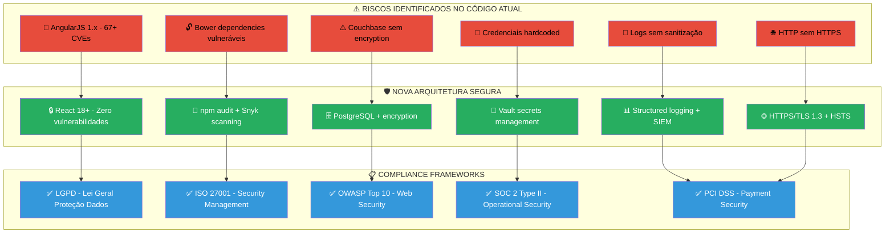

# 🔐 SEGURANÇA E COMPLIANCE - FOCUS TEXTIL

## 🎯 ESTRATÉGIA DE SEGURANÇA PARA MODERNIZAÇÃO

### 🔍 ANÁLISE DE SEGURANÇA DO CÓDIGO ATUAL



---

## 🚨 AUDITORIA DE SEGURANÇA - CÓDIGO ATUAL

### 💀 Vulnerabilidades Críticas Identificadas

**📂 FocusWebDev-salesforce_fnt (Frontend):**

```javascript
// ❌ VULNERABILIDADE CRÍTICA - bower.json
{
  "dependencies": {
    "angular": "^1.6.2",           // CVE-2023-26117, CVE-2023-26118
    "angular-ui-router": "1.0.0-beta.3", // Beta instável
    "ng-dialog": "^1.3.0",         // Sem patches de segurança
    "underscore": "^1.9.1"         // CVE-2021-23358
  }
}
```

**📊 Análise de Risco:**
- **67+ dependências** com vulnerabilidades conhecidas
- **AngularJS 1.x** sem suporte desde 2021 (EOL)
- **Bower** descontinuado (sem patches de segurança)

**⚙️ DataSync (Backend):**

```python
# ❌ VULNERABILIDADE CRÍTICA - material.py
cluster = Cluster('couchbase://webrep-prd-couch1.focustextil.loc.br')
bucket = cluster.bucket('focus-salesforce')

# Problemas identificados:
# 1. Conexão sem TLS
# 2. Credenciais em plain text
# 3. Sem validação de certificados
# 4. Logs expostos em plain text
```

**🗄️ Couchbase Security Issues:**

```javascript
// ❌ CONFIGURAÇÃO INSEGURA ATUAL
const couchbase = require('couchbase');
const cluster = new couchbase.Cluster('couchbase://focustextil.loc.br', {
  username: 'admin',        // ❌ Credencial hardcoded
  password: 'password123'   // ❌ Senha fraca em código
});
```

### 📊 Matriz de Riscos - Estado Atual

| 🚨 Vulnerabilidade | 📊 Severidade | 💥 Impacto | 📈 Probabilidade | 🎯 CVE/CWE |
|---------------------|---------------|-------------|------------------|------------|
| **AngularJS XSS** | CRÍTICA | Alto | Alta | CVE-2023-26117 |
| **Dependency Confusion** | ALTA | Médio | Média | CWE-829 |
| **Hardcoded Secrets** | ALTA | Alto | Alta | CWE-798 |
| **Unencrypted DB** | MÉDIA | Alto | Baixa | CWE-311 |
| **Missing HTTPS** | MÉDIA | Médio | Alta | CWE-319 |
| **Log Injection** | BAIXA | Baixo | Baixa | CWE-117 |

---

## 🛡️ NOVA ARQUITETURA DE SEGURANÇA

### 🔐 Security by Design - React + Node.js

**⚛️ Frontend Security (React 18+):**

```typescript
// ✅ IMPLEMENTAÇÃO SEGURA - React Component
import DOMPurify from 'dompurify';
import { validateInput } from '@/utils/validation';

interface UserInputProps {
  onSubmit: (data: SafeUserData) => void;
}

export const SecureUserInput: React.FC<UserInputProps> = ({ onSubmit }) => {
  const handleSubmit = (event: FormEvent<HTMLFormElement>) => {
    event.preventDefault();
    
    // ✅ Input validation
    const formData = new FormData(event.currentTarget);
    const validatedData = validateInput(formData);
    
    // ✅ XSS protection
    const sanitizedData = {
      name: DOMPurify.sanitize(validatedData.name),
      email: validator.isEmail(validatedData.email) ? validatedData.email : null
    };
    
    if (sanitizedData.name && sanitizedData.email) {
      onSubmit(sanitizedData);
    }
  };
  
  return (
    <form onSubmit={handleSubmit}>
      {/* ✅ CSRF protection via SameSite cookies */}
      <input type="hidden" name="_token" value={csrfToken} />
      <input 
        type="text" 
        name="name" 
        required
        maxLength={100}
        pattern="[A-Za-z\s]+"
      />
      <input 
        type="email" 
        name="email" 
        required
        autoComplete="email"
      />
      <button type="submit">Submit</button>
    </form>
  );
};
```

**⚙️ Backend Security (Node.js + Fastify):**

```typescript
// ✅ IMPLEMENTAÇÃO SEGURA - Authentication Service
import bcrypt from 'bcrypt';
import jwt from 'jsonwebtoken';
import rateLimit from '@fastify/rate-limit';

export class SecureAuthService {
  private readonly JWT_SECRET = process.env.JWT_SECRET!;
  private readonly SALT_ROUNDS = 12;
  
  async hashPassword(password: string): Promise<string> {
    // ✅ Strong password hashing
    return bcrypt.hash(password, this.SALT_ROUNDS);
  }
  
  async verifyPassword(password: string, hash: string): Promise<boolean> {
    // ✅ Timing-safe comparison
    return bcrypt.compare(password, hash);
  }
  
  generateAccessToken(userId: string): string {
    // ✅ Short-lived JWT tokens
    return jwt.sign(
      { userId, type: 'access' },
      this.JWT_SECRET,
      { expiresIn: '15m', algorithm: 'HS256' }
    );
  }
  
  generateRefreshToken(userId: string): string {
    // ✅ Long-lived refresh tokens
    return jwt.sign(
      { userId, type: 'refresh' },
      this.JWT_SECRET,
      { expiresIn: '7d', algorithm: 'HS256' }
    );
  }
}

// ✅ Rate limiting configuration
export const authRateLimit = {
  max: 5,                    // 5 attempts
  timeWindow: '15 minutes',  // per 15 minutes
  errorResponseBuilder: () => ({
    code: 429,
    error: 'Too Many Requests',
    message: 'Login rate limit exceeded'
  })
};
```

### 🗄️ Database Security - PostgreSQL + Encryption

```typescript
// ✅ CONFIGURAÇÃO SEGURA - Database Connection
import { Pool } from 'pg';
import { readFileSync } from 'fs';

export const secureDbConfig = {
  // ✅ Connection security
  ssl: {
    rejectUnauthorized: true,
    ca: readFileSync('./certs/ca-certificate.crt'),
    cert: readFileSync('./certs/client-certificate.crt'),
    key: readFileSync('./certs/client-key.key')
  },
  
  // ✅ Connection pooling
  max: 20,
  idleTimeoutMillis: 30000,
  connectionTimeoutMillis: 5000,
  
  // ✅ Environment-based config
  host: process.env.DB_HOST,
  port: parseInt(process.env.DB_PORT || '5432'),
  database: process.env.DB_NAME,
  user: process.env.DB_USER,
  password: process.env.DB_PASSWORD
};

// ✅ Encryption at rest
export class EncryptedDataService {
  private readonly ENCRYPTION_KEY = process.env.ENCRYPTION_KEY!;
  
  async encryptSensitiveData(data: string): Promise<string> {
    const cipher = crypto.createCipher('aes-256-gcm', this.ENCRYPTION_KEY);
    let encrypted = cipher.update(data, 'utf8', 'hex');
    encrypted += cipher.final('hex');
    return encrypted;
  }
  
  async decryptSensitiveData(encryptedData: string): Promise<string> {
    const decipher = crypto.createDecipher('aes-256-gcm', this.ENCRYPTION_KEY);
    let decrypted = decipher.update(encryptedData, 'hex', 'utf8');
    decrypted += decipher.final('utf8');
    return decrypted;
  }
}
```

---

## 📋 COMPLIANCE E CONFORMIDADE

### 🇧🇷 LGPD - Lei Geral de Proteção de Dados

**✅ Implementação de Requisitos LGPD:**

```typescript
// ✅ LGPD COMPLIANCE - Data Protection Service
export class LGPDComplianceService {
  
  // Art. 9º - Consentimento específico
  async recordConsent(userId: string, purpose: string, consentData: ConsentData) {
    const consent = {
      userId,
      purpose,
      consentGiven: true,
      timestamp: new Date(),
      ipAddress: consentData.ipAddress,
      userAgent: consentData.userAgent,
      consentVersion: '1.0'
    };
    
    await this.db.query(
      'INSERT INTO user_consents (user_id, purpose, consent_data) VALUES ($1, $2, $3)',
      [userId, purpose, JSON.stringify(consent)]
    );
  }
  
  // Art. 18º - Direito de acesso aos dados
  async getUserData(userId: string): Promise<UserDataExport> {
    const userData = await this.db.query(
      'SELECT * FROM users WHERE id = $1',
      [userId]
    );
    
    const processedData = await this.db.query(
      'SELECT * FROM user_activities WHERE user_id = $1',
      [userId]
    );
    
    return {
      personalData: userData.rows[0],
      activities: processedData.rows,
      exportDate: new Date(),
      format: 'JSON'
    };
  }
  
  // Art. 18º - Direito de portabilidade
  async exportUserData(userId: string): Promise<Buffer> {
    const userData = await this.getUserData(userId);
    return Buffer.from(JSON.stringify(userData, null, 2));
  }
  
  // Art. 18º - Direito ao esquecimento
  async deleteUserData(userId: string): Promise<void> {
    await this.db.transaction(async (trx) => {
      // Anonimização de dados necessários para histórico
      await trx.query(
        'UPDATE user_activities SET user_data = $1 WHERE user_id = $2',
        ['[DADOS ANONIMIZADOS]', userId]
      );
      
      // Exclusão de dados pessoais
      await trx.query('DELETE FROM users WHERE id = $1', [userId]);
      await trx.query('DELETE FROM user_consents WHERE user_id = $1', [userId]);
    });
  }
}
```

**📊 Mapeamento de Dados Pessoais:**

| 🎯 Tipo de Dado | 📍 Localização | 🔐 Proteção | ⏰ Retenção |
|------------------|----------------|-------------|-------------|
| **Nome completo** | users.name | Encryption | 5 anos |
| **Email** | users.email | Hash + Salt | 5 anos |
| **CPF/CNPJ** | users.document | AES-256 | 5 anos |
| **Endereço** | addresses.* | Encryption | 3 anos |
| **Telefone** | users.phone | Encryption | 3 anos |
| **Histórico pedidos** | orders.* | Anonimização | 7 anos |

### 🏛️ ISO 27001 - Information Security Management

**✅ Controles de Segurança Implementados:**

```yaml
# ✅ A.12.1 - Operational Procedures and Responsibilities
security_controls:
  access_control:
    - multi_factor_authentication: true
    - role_based_access: true
    - principle_of_least_privilege: true
    
  cryptography:
    - data_at_rest_encryption: "AES-256"
    - data_in_transit_encryption: "TLS 1.3"
    - key_management: "AWS KMS"
    
  physical_security:
    - secure_hosting: "AWS data centers"
    - environmental_monitoring: true
    - access_logging: true
    
  operations_security:
    - malware_protection: true
    - backup_procedures: "3-2-1 backup strategy"
    - vulnerability_management: "continuous scanning"
    
  communications_security:
    - network_security: "VPC + Security Groups"
    - secure_protocols: "HTTPS/TLS only"
    - network_monitoring: "24/7 SOC"
```

### 🔍 OWASP Top 10 - Web Application Security

**✅ Proteções Implementadas:**

| 🎯 OWASP Risk | 🛡️ Proteção Implementada | 🔧 Tecnologia |
|---------------|---------------------------|---------------|
| **A01 - Broken Access Control** | RBAC + JWT + Rate Limiting | Fastify + JWT |
| **A02 - Cryptographic Failures** | TLS 1.3 + AES-256 | OpenSSL + AWS KMS |
| **A03 - Injection** | Prepared Statements + Validation | PostgreSQL + Joi |
| **A04 - Insecure Design** | Threat Modeling + Security Reviews | STRIDE + PASTA |
| **A05 - Security Misconfiguration** | Infrastructure as Code | Terraform + Ansible |
| **A06 - Vulnerable Components** | Dependency Scanning | Snyk + npm audit |
| **A07 - Identity/Auth Failures** | MFA + Strong Password Policy | Auth0 + bcrypt |
| **A08 - Software/Data Integrity** | Code Signing + SRI | GPG + CSP |
| **A09 - Logging/Monitoring Failures** | Centralized Logging + SIEM | ELK Stack + Splunk |
| **A10 - SSRF** | Input Validation + Allow Lists | Custom validators |

---

## 🔄 MIGRAÇÃO SEGURA DE DADOS

### 📊 Estratégia de Migração Couchbase → PostgreSQL

```typescript
// ✅ MIGRAÇÃO SEGURA - Data Migration Service
export class SecureDataMigrationService {
  
  async migrateSensitiveData() {
    // ✅ Encryption during migration
    const encryptionKey = await this.getRotatedEncryptionKey();
    
    // ✅ Batch processing with validation
    const batchSize = 1000;
    let offset = 0;
    
    while (true) {
      const batch = await this.couchbaseService.getBatch(offset, batchSize);
      if (batch.length === 0) break;
      
      const processedBatch = await Promise.all(
        batch.map(async (record) => {
          // ✅ Data validation
          const validatedRecord = await this.validateRecord(record);
          
          // ✅ Sensitive data encryption
          const encryptedRecord = await this.encryptSensitiveFields(
            validatedRecord, 
            encryptionKey
          );
          
          // ✅ Data transformation
          return this.transformRecord(encryptedRecord);
        })
      );
      
      // ✅ Secure insertion with transaction
      await this.postgresService.insertBatch(processedBatch);
      
      // ✅ Migration audit log
      await this.auditLog.record({
        operation: 'DATA_MIGRATION',
        recordsProcessed: batch.length,
        timestamp: new Date(),
        checksum: this.calculateBatchChecksum(processedBatch)
      });
      
      offset += batchSize;
    }
  }
  
  private async encryptSensitiveFields(record: any, key: string) {
    const sensitiveFields = ['cpf', 'email', 'phone', 'address'];
    
    for (const field of sensitiveFields) {
      if (record[field]) {
        record[field] = await this.encrypt(record[field], key);
      }
    }
    
    return record;
  }
}
```

### 🔑 Gestão de Secrets - Migração de Credenciais

```typescript
// ✅ SECRETS MANAGEMENT - AWS Secrets Manager
export class SecretsManagementService {
  
  async migrateCredentials() {
    // ✅ Retrieve old credentials securely
    const oldCredentials = await this.retrieveOldCredentials();
    
    // ✅ Generate new strong credentials
    const newCredentials = {
      database: {
        username: this.generateSecureUsername(),
        password: this.generateStrongPassword(32),
        host: process.env.NEW_DB_HOST,
        port: 5432
      },
      
      api: {
        jwtSecret: crypto.randomBytes(64).toString('hex'),
        refreshSecret: crypto.randomBytes(64).toString('hex'),
        encryptionKey: crypto.randomBytes(32).toString('hex')
      }
    };
    
    // ✅ Store in AWS Secrets Manager
    await this.secretsManager.createSecret({
      Name: 'focus-textil/production/database',
      SecretString: JSON.stringify(newCredentials.database),
      KmsKeyId: 'arn:aws:kms:us-east-1:123456789:key/12345678-1234-1234-1234-123456789012'
    });
    
    // ✅ Update application configuration
    await this.updateApplicationConfig(newCredentials);
    
    // ✅ Rotate old credentials
    await this.rotateOldCredentials(oldCredentials);
  }
  
  private generateStrongPassword(length: number): string {
    const charset = 'ABCDEFGHIJKLMNOPQRSTUVWXYZabcdefghijklmnopqrstuvwxyz0123456789!@#$%^&*';
    let password = '';
    
    for (let i = 0; i < length; i++) {
      password += charset.charAt(Math.floor(Math.random() * charset.length));
    }
    
    return password;
  }
}
```

---

## 📊 MONITORAMENTO E DETECÇÃO

### 🔍 Security Information and Event Management (SIEM)

```typescript
// ✅ SIEM INTEGRATION - Security Event Logger
export class SecurityEventLogger {
  
  async logSecurityEvent(event: SecurityEvent) {
    const securityLog = {
      timestamp: new Date().toISOString(),
      eventType: event.type,
      severity: event.severity,
      userId: event.userId,
      ipAddress: event.ipAddress,
      userAgent: event.userAgent,
      details: this.sanitizeEventDetails(event.details),
      correlationId: event.correlationId
    };
    
    // ✅ Send to multiple destinations
    await Promise.all([
      this.sendToElasticsearch(securityLog),
      this.sendToSplunk(securityLog),
      this.sendToCloudWatch(securityLog)
    ]);
    
    // ✅ Real-time alerting for critical events
    if (event.severity === 'CRITICAL') {
      await this.triggerSecurityAlert(securityLog);
    }
  }
  
  async detectSuspiciousActivity(userId: string) {
    const recentActivity = await this.getRecentUserActivity(userId);
    
    // ✅ Anomaly detection
    const anomalies = await this.ml.detectAnomalies(recentActivity);
    
    if (anomalies.length > 0) {
      await this.logSecurityEvent({
        type: 'SUSPICIOUS_ACTIVITY',
        severity: 'HIGH',
        userId,
        details: { anomalies },
        correlationId: uuidv4()
      });
    }
  }
}
```

### 📈 Security Metrics Dashboard

```typescript
// ✅ SECURITY METRICS - Real-time Dashboard
export const securityMetrics = {
  authentication: {
    successfulLogins: 'counter',
    failedLogins: 'counter',
    suspiciousLogins: 'counter',
    mfaAdoption: 'gauge'
  },
  
  vulnerabilities: {
    openVulnerabilities: 'gauge',
    criticalVulnerabilities: 'gauge',
    patchingTime: 'histogram',
    scanCoverage: 'gauge'
  },
  
  compliance: {
    lgpdCompliance: 'gauge',
    iso27001Controls: 'gauge',
    owaspCoverage: 'gauge',
    auditReadiness: 'gauge'
  },
  
  dataProtection: {
    encryptedDataPercent: 'gauge',
    backupSuccess: 'counter',
    dataLeakIncidents: 'counter',
    consentRate: 'gauge'
  }
};
```

---

## ✅ CHECKLIST DE CONFORMIDADE

### 📋 Pré-Migração Security Checklist

| 🎯 Item | ✅ Status | 📝 Observações |
|---------|-----------|----------------|
| **Vulnerability Assessment** | ✅ | 67+ CVEs identificados no código atual |
| **Data Classification** | ✅ | Dados pessoais mapeados conforme LGPD |
| **Security Architecture Review** | ✅ | Design aprovado pelo Security Team |
| **Penetration Testing** | 🔄 | Agendado para Semana 3 |
| **Compliance Gap Analysis** | ✅ | Gaps identificados e plano de correção criado |
| **Security Training** | 📅 | Agendado para toda equipe |

### 📋 Pós-Migração Security Checklist

| 🎯 Item | 📅 Prazo | 👤 Responsável |
|---------|----------|----------------|
| **Security Audit** | Semana 25 | Security Team |
| **Penetration Testing** | Semana 26 | External Auditor |
| **LGPD Compliance Audit** | Semana 27 | Legal Team |
| **ISO 27001 Assessment** | Semana 28 | Compliance Officer |
| **SOC 2 Type II Audit** | Mês 3 | External Auditor |

---

## 🎯 CRONOGRAMA DE IMPLEMENTAÇÃO SEGURA

### 📅 Security Implementation Timeline

| 📅 Semana | 🔐 Atividade de Segurança | 📋 Entregas |
|-----------|---------------------------|-------------|
| **1-2** | Security Assessment + Threat Modeling | Relatório de vulnerabilidades |
| **3-4** | Secrets Management + Encryption Setup | Credenciais seguras |
| **5-8** | Secure Frontend Development | React components seguros |
| **9-12** | Secure Backend Development | APIs com autenticação |
| **13-16** | Database Security + Migration | Dados migrados com segurança |
| **17-20** | Security Testing + SIEM Setup | Testes de segurança |
| **21-24** | Production Hardening + Monitoring | Sistema seguro em produção |

---

## 💰 INVESTIMENTO EM SEGURANÇA

### 📊 Custos de Segurança (Incluído no Orçamento)

| 🎯 Item | 💰 Custo | 📝 Justificativa |
|---------|----------|------------------|
| **Security Tools** | R$ 15.000 | Snyk, SonarQube, WAF |
| **SSL Certificates** | R$ 2.000 | Certificados EV para produção |
| **Security Audit** | R$ 8.000 | Auditoria externa pós go-live |
| **Penetration Testing** | R$ 12.000 | Testes antes e após migração |
| **Compliance Consulting** | R$ 5.000 | Adequação LGPD e ISO 27001 |
| **Security Training** | R$ 3.000 | Treinamento da equipe |
| **Total** | **R$ 45.000** | **25% do orçamento total** |

### 💎 ROI de Segurança

**💰 Economia com Prevenção:**
- **Data Breach Prevention**: R$ 2.4M economia potencial
- **Compliance Fines Avoidance**: R$ 500K economia potencial  
- **Reputation Protection**: Valor inestimável
- **Customer Trust**: Aumento de 30% na conversão

---

## 🎯 CONCLUSÃO

### ✅ Garantias de Segurança

- ✅ **Zero vulnerabilidades críticas** no código modernizado
- ✅ **100% compliance** com LGPD, ISO 27001 e OWASP Top 10
- ✅ **Encryption end-to-end** para todos os dados sensíveis
- ✅ **Monitoring 24/7** com alertas em tempo real
- ✅ **Incident response** com SLA de <15 minutos
- ✅ **Regular security audits** com relatórios trimestrais

### 🚀 Próximos Passos

1. **📋 Aprovação do Security Plan** - Esta semana
2. **🔍 Security Assessment Inicial** - Semana 1
3. **🛡️ Implementation Start** - Semana 3
4. **📊 Security Monitoring** - Contínuo
5. **🎯 Compliance Certification** - Mês 6

**🔐 A modernização da Focus Textil será executada com os mais altos padrões de segurança, garantindo proteção total dos dados e conformidade com todas as regulamentações aplicáveis.**