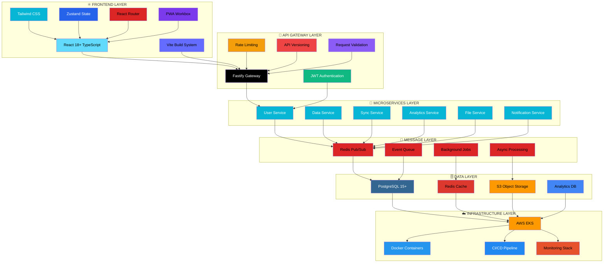

# ⚙️ STACK TECNOLÓGICO - MODERNIZAÇÃO FOCUS TEXTIL

## 🎯 ARQUITETURA DA STACK MODERNA

---

## 📊 JUSTIFICATIVAS TÉCNICAS DETALHADAS

### ⚛️ Frontend: React 18+ como Escolha Estratégica

**Por que React foi escolhido sobre outras alternativas:**

| 🎯 Critério              | ⚛️ React   | 🅰️ Angular | 💚 Vue.js | 📈 Vencedor |
| ------------------------ | ---------- | ---------- | --------- | ----------- |
| **Performance**          | ⭐⭐⭐⭐⭐ | ⭐⭐⭐⭐   | ⭐⭐⭐⭐  | React       |
| **Ecosystem**            | ⭐⭐⭐⭐⭐ | ⭐⭐⭐⭐   | ⭐⭐⭐    | React       |
| **Market Adoption**      | ⭐⭐⭐⭐⭐ | ⭐⭐⭐⭐   | ⭐⭐⭐    | React       |
| **Developer Experience** | ⭐⭐⭐⭐⭐ | ⭐⭐⭐     | ⭐⭐⭐⭐  | React       |

**React 18+ - Recursos Críticos:**

- **Concurrent Features**: Rendering não-bloqueante para melhor UX
- **Automatic Batching**: Otimização automática de performance
- **Suspense**: Estados de loading elegantes e consistentes
- **Server Components**: SSR otimizado para SEO e performance

### ⚡ Build System: Vite vs. Webpack

**Performance Comparison:**

| 🎯 Métrica        | ⚡ Vite | 📦 Webpack | 🎁 Rollup |
| ----------------- | ------- | ---------- | --------- |
| **Cold Start**    | 1-2s    | 15-30s     | 10-20s    |
| **HMR Speed**     | <100ms  | 1-3s       | 1-2s      |
| **Configuration** | Mínima  | Complexa   | Média     |
| **TypeScript**    | Nativo  | Plugin     | Plugin    |

**Vantagens do Vite:**

- **10x Faster Builds**: Desenvolvimento muito mais ágil
- **Native ESM**: Aproveita recursos nativos do browser
- **Zero Configuration**: Setup rápido e fácil manutenção

---

## ⚙️ BACKEND: MICROSERVIÇOS COM FASTIFY

### 🚀 Fastify vs. Express Performance

| 🎯 Framework   | 📈 Performance | 🔍 TypeScript | ✅ Validation |
| -------------- | -------------- | ------------- | ------------- |
| **⚡ Fastify** | 45k req/s      | Nativo        | Built-in      |
| **🟢 Express** | 22k req/s      | Plugin        | Middleware    |
| **🎭 Koa**     | 35k req/s      | Plugin        | Middleware    |

**Por que Fastify:**

- **2x Performance**: Dobro da velocidade do Express
- **TypeScript First**: Suporte nativo completo
- **Schema Validation**: Validação automática de requests
- **Plugin System**: Arquitetura modular elegante

### 🗄️ Database: Migração de Couchbase para PostgreSQL + Redis

**Situação Atual do Cliente:**

- **Couchbase**: Database principal (focustextil.loc.br)
- **SAP Gateway**: Integração para sincronização de dados
- **Python ETL**: Scripts complexos para processamento (754 linhas)
- **Infraestrutura**: On-premise focustextil.loc.br

**PostgreSQL - Escolha Futura:**

| 🎯 Critério         | 🐘 PostgreSQL | 📱 Couchbase | 💡 Vantagem  |
| ------------------- | ------------- | ------------ | ------------ |
| **ACID Compliance** | ⭐⭐⭐⭐⭐    | ⭐⭐⭐       | Transacional |
| **SQL Standard**    | ⭐⭐⭐⭐⭐    | ⭐⭐         | Familiar     |
| **Cloud Native**    | ⭐⭐⭐⭐⭐    | ⭐⭐⭐       | AWS RDS      |
| **Cost Efficiency** | ⭐⭐⭐⭐⭐    | ⭐⭐⭐       | Open Source  |

**Estratégia de Migração:**

- **ETL Pipeline**: Migração gradual dos dados Couchbase
- **SAP Integration**: Manutenção da integração durante transição
- **Redis Cache**: Otimização de performance pós-migração
- **Backup Strategy**: Sincronização bidireccional durante migração

---

## 🔧 DEVOPS & INFRASTRUCTURE

### 🐳 Containerization: Docker + Kubernetes

**Container Strategy Benefits:**

- **Consistency**: Mesmo ambiente dev/staging/prod
- **Scalability**: Auto-scaling baseado em demanda
- **Reliability**: Self-healing e health checks
- **Deployment**: Zero-downtime deployments

### ☁️ Cloud Provider: AWS Justification

| 🎯 Critério      | ☁️ AWS     | 🌐 GCP     | 🔵 Azure   |
| ---------------- | ---------- | ---------- | ---------- |
| **Services**     | ⭐⭐⭐⭐⭐ | ⭐⭐⭐⭐   | ⭐⭐⭐⭐   |
| **Performance**  | ⭐⭐⭐⭐⭐ | ⭐⭐⭐⭐⭐ | ⭐⭐⭐⭐   |
| **Market Share** | ⭐⭐⭐⭐⭐ | ⭐⭐⭐     | ⭐⭐⭐⭐   |
| **Support**      | ⭐⭐⭐⭐   | ⭐⭐⭐⭐   | ⭐⭐⭐⭐⭐ |

**AWS Vencedor por**: Ecosystem completo + market leadership + confiabilidade comprovada

---

## 🧪 TESTING STRATEGY

### 📊 Test Pyramid Implementation

**Distribuição de Testes:**

- **Unit Tests (70%)**: Jest + React Testing Library
- **Integration Tests (20%)**: Supertest + Test Containers
- **E2E Tests (10%)**: Playwright

| 🎯 Tipo         | 🛠️ Ferramenta | 📊 Coverage         | ⏰ Execução |
| --------------- | ------------- | ------------------- | ----------- |
| **Unit Tests**  | Jest + RTL    | 80%+                | <30s        |
| **Integration** | Supertest     | 60%+                | 2-3min      |
| **E2E Tests**   | Playwright    | 90%+ critical paths | 10-15min    |
| **Performance** | k6            | All APIs            | 5min        |

---

## 🔐 SECURITY & COMPLIANCE

### 🛡️ Security Layers

| 🎯 Layer          | 🛠️ Technology        | 📝 Purpose                     |
| ----------------- | -------------------- | ------------------------------ |
| **Edge Security** | Cloudflare WAF       | DDoS protection, bot filtering |
| **API Security**  | JWT + Refresh Tokens | Authentication & authorization |
| **Data Security** | AES-256 encryption   | Data at rest & in transit      |
| **Code Security** | Snyk + SonarQube     | Vulnerability scanning         |

### 🔒 OWASP Top 10 Compliance

- ✅ **Injection**: Parameterized queries + validation
- ✅ **Broken Authentication**: JWT + MFA
- ✅ **Sensitive Data Exposure**: Encryption + HTTPS
- ✅ **Security Misconfiguration**: Infrastructure as Code
- ✅ **Cross-Site Scripting**: CSP headers + encoding

---

## ⚡ PERFORMANCE OPTIMIZATION

### 🚀 Frontend Performance Techniques

| 🎯 Técnica             | 📈 Impacto              | 🛠️ Implementação         |
| ---------------------- | ----------------------- | ------------------------ |
| **Code Splitting**     | 60% reduction bundle    | React.lazy + Suspense    |
| **Lazy Loading**       | 40% faster initial load | Intersection Observer    |
| **Image Optimization** | 70% smaller images      | WebP + responsive images |
| **Service Worker**     | Offline capability      | Workbox implementation   |

### ⚙️ Backend Performance Techniques

| 🎯 Técnica             | 📈 Impacto                   | 🛠️ Implementação     |
| ---------------------- | ---------------------------- | -------------------- |
| **Redis Caching**      | 80% faster queries           | Strategic cache keys |
| **Database Indexing**  | 90% query optimization       | Optimized indices    |
| **Connection Pooling** | 50% resource efficiency      | PgBouncer            |
| **CDN**                | 40% global latency reduction | CloudFront           |

---

## 🎯 CONCLUSION & NEXT STEPS

### ✅ Technology Decision Summary

| 🎯 Category            | 🏆 Chosen Technology    | 💡 Key Reason                           |
| ---------------------- | ----------------------- | --------------------------------------- |
| **Frontend Framework** | React 18+ TypeScript    | Performance + ecosystem + future-proof  |
| **Build Tool**         | Vite                    | 10x faster builds + modern architecture |
| **Backend Framework**  | Fastify + TypeScript    | 2x performance + type safety            |
| **Database**           | PostgreSQL + Redis      | ACID compliance + performance           |
| **Cloud**              | AWS                     | Reliability + complete ecosystem        |
| **Testing**            | Jest + RTL + Playwright | Industry standard + comprehensive       |

### 🚀 Implementation Readiness

- ✅ **Architecture Defined**: Complete system design documented
- ✅ **Technology Chosen**: Battle-tested, modern stack
- ✅ **Team Ready**: Specialists in all proposed technologies
- ✅ **Migration Strategy**: Phased approach with rollback capability
- ✅ **Risk Mitigation**: Comprehensive risk assessment and mitigation

**🎯 Status: READY TO PROCEED**

A stack proposta representa o estado da arte em desenvolvimento web moderno, garantindo performance, security, maintainability e scalability para os próximos 5+ anos.
