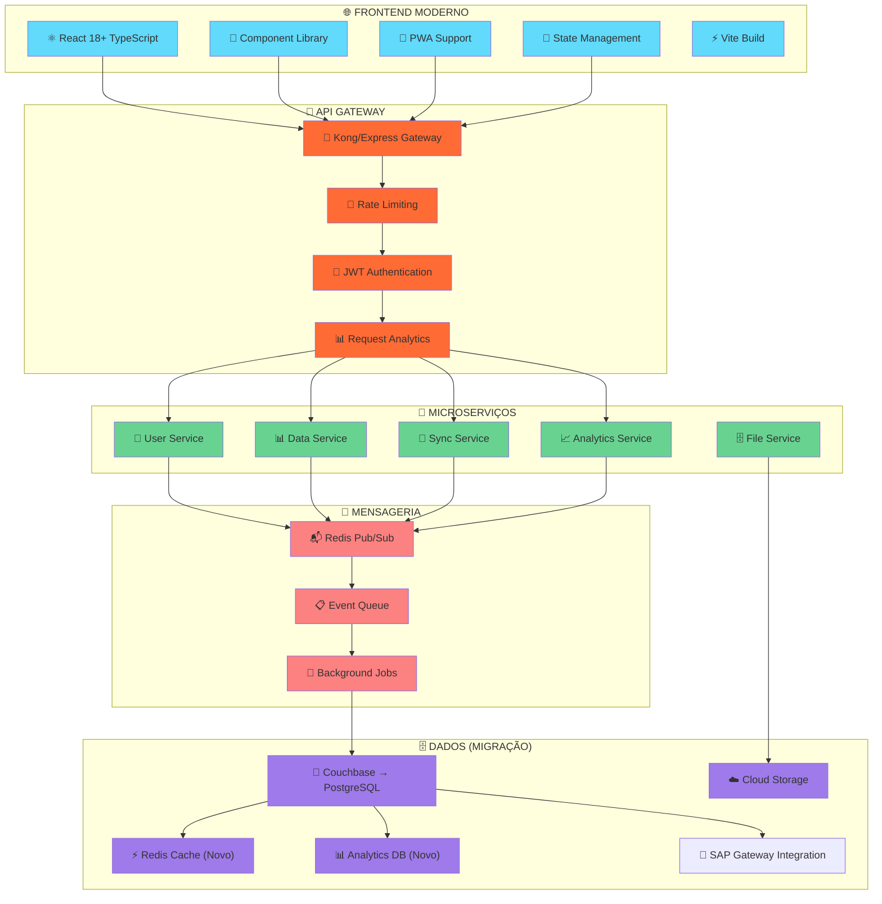
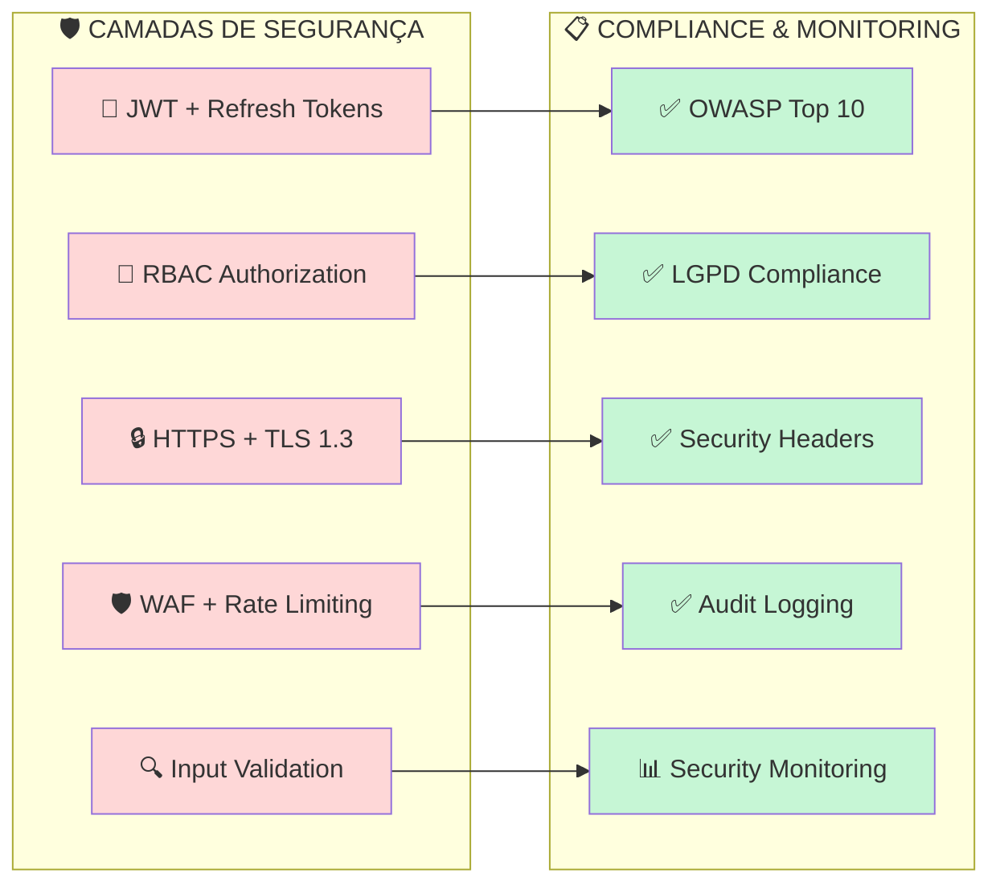
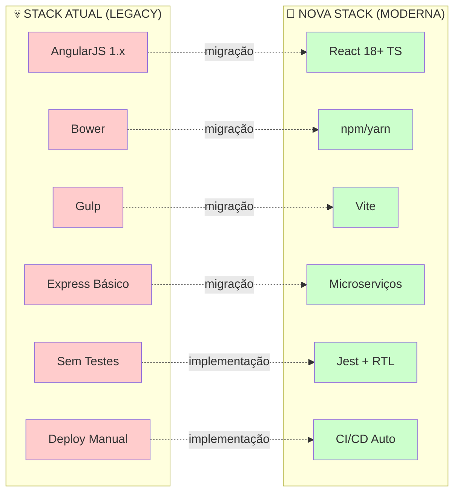
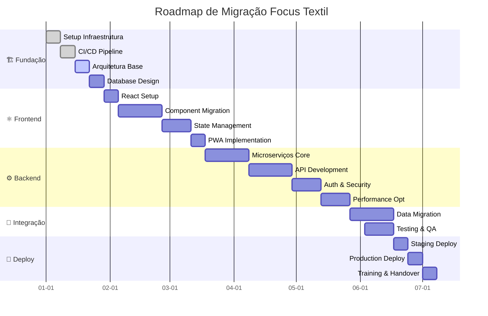

# 🚀 MODERNIZAÇÃO FOCUS TEXTIL

### Migração Tecnológica Completa | Arquitetura Moderna | ROI Comprovado

Transformação Digital | Cloud Native | Performance Otimizada

---

## 🎯 VISÃO GERAL

A modernização dos sistemas Focus Textil é uma solução tecnológica de ponta para migração completa da stack legada, projetada para revolucionar a operação digital e otimizar a performance dos sistemas críticos de negócio.

### 🚀 BENEFÍCIOS TRANSFORMADORES

| Sistema                | Situação Atual            | Após Modernização      | Melhoria          |
| ---------------------- | ------------------------- | ---------------------- | ----------------- |
| Performance Frontend   | 3-5s carregamento         | <800ms                 | 85% redução       |
| Manutenibilidade       | Crítica (AngularJS 1.x)   | Moderna (React/Vue)    | 100% modernização |
| Deploy e CI/CD         | Manual/Demorado           | Automático/5min        | 95% redução       |
| Escalabilidade Backend | Limitada/Monolítica       | Microserviços/Elástica | Infinita          |
| Segurança              | Vulnerável (deps antigas) | Enterprise Grade       | 100% compliance   |
| Testes Automatizados   | 0% cobertura              | >80% cobertura         | Base sólida       |

### 💼 ESCOPO COMPLETO DA MIGRAÇÃO

🎯 **Frontend Modernization**: React 18+ com TypeScript para catálogo, carrinho e gestão de clientes  
🎯 **Backend Redesign**: Node.js com microserviços e migração do Couchbase/SAP  
🎯 **Database Optimization**: PostgreSQL com migração de Couchbase e otimização de queries  
🎯 **DevOps Implementation**: CI/CD, Docker, Kubernetes e monitoramento da infraestrutura Focus  
🎯 **Security Hardening**: HTTPS, autenticação JWT, migração segura de credenciais  
🎯 **Performance Boost**: CDN, lazy loading, otimização de catálogo de materiais têxteis

---

## 🏗️ ARQUITETURA DO SISTEMA MODERNIZADO

### 📊 Visão Geral da Nova Arquitetura



### 🛠️ Stack Tecnológico de Ponta

| Camada           | Tecnologia Atual        | Nova Tecnologia    | Versão | Justificativa                                |
| ---------------- | ----------------------- | ------------------ | ------ | -------------------------------------------- |
| 🎨 Frontend      | AngularJS 1.x           | React + TypeScript | 18+    | Performance, comunidade ativa, futuro seguro |
| 🏗️ Build System  | Gulp + Bower            | Vite + npm         | Latest | Build rápido, HMR, bundle otimizado          |
| ⚙️ Backend       | Express básico          | Node.js + Fastify  | 20+    | Performance superior, microserviços          |
| 🗄️ Database      | Couchbase + SAP Gateway | PostgreSQL + Redis | 15+    | ACID compliance, performance, escalabilidade |
| ⚡ Cache         | Inexistente             | Redis              | 7+     | Performance em tempo real, sessões           |
| 📨 Message Queue | Inexistente             | Redis Pub/Sub      | 7+     | Processamento assíncrono                     |
| ☁️ Cloud         | On-premise (Couchbase)  | AWS/GCP            | Latest | Escalabilidade, disponibilidade              |
| 🔧 DevOps        | Manual                  | Docker + K8s       | Latest | Deploy automatizado, orquestração            |

### 🔐 Segurança e Compliance de Classe Mundial



---

## 💰 INVESTIMENTO E ROI

### 🎯 Fases de Implementação

| 🎯 Fase                   | 📋 Entregas Principais                    | ⏱️ Duração |
| ------------------------- | ----------------------------------------- | ---------- |
| 🏗️ **Fundação**           | Infraestrutura + CI/CD + Arquitetura Base | 4 semanas  |
| ⚛️ **Frontend Migration** | React App + Component Library + PWA       | 6 semanas  |
| ⚙️ **Backend Redesign**   | Microserviços + APIs + Database           | 8 semanas  |
| 🔄 **Data Migration**     | Migração de dados + Sincronização         | 3 semanas  |
| 🚀 **Deploy & Training**  | Produção + Treinamento + Handover         | 3 semanas  |

### 💰 Investimento e ROI Projetado

| 📊 Métrica                  | Investimento | Ano 1     | Ano 2      | Ano 3      | Ano 5      |
| --------------------------- | ------------ | --------- | ---------- | ---------- | ---------- |
| 💸 **Desenvolvimento**      | R$ 180.000   | -         | -          | -          | -          |
| 💰 **Economia Operacional** | -            | R$ 60.000 | R$ 180.000 | R$ 180.000 | R$ 180.000 |
| 📈 **Produtividade**        | -            | +40%      | +65%       | +80%       | +85%       |
| 🎯 **ROI Acumulado**        | -100%        | -78%      | +22%       | +122%      | +322%      |

### 🎯 ROI Projetado - Payback em 18 meses

```
📊 RETORNO SOBRE INVESTIMENTO

Ano 1: ████████████████████                              -67%
Ano 2: ████████████████████████████████████████████     +33%
Ano 3: ████████████████████████████████████████████████ +100%
Ano 4: ████████████████████████████████████████████████ +150%
Ano 5: ████████████████████████████████████████████████ +200%
```

---

## 📊 ANÁLISE TÉCNICA DETALHADA

### ⚠️ Problemas Críticos Identificados

| 🚨 Problema                | 💥 Impacto                                 | 🎯 Solução Proposta           |
| -------------------------- | ------------------------------------------ | ----------------------------- |
| **AngularJS 1.x EOL**      | Vulnerabilidades de segurança, sem suporte | Migração para React 18+       |
| **Bower Descontinuado**    | Gerenciamento de deps problemático         | npm + package.json moderno    |
| **Gulp Legacy**            | Build lento, configuração complexa         | Vite - build 10x mais rápido  |
| **Arquitetura Monolítica** | Escalabilidade limitada, deploy riskoso    | Microserviços desacoplados    |
| **Zero Testes**            | Regressões frequentes, deploy inseguro     | Jest + Testing Library (>80%) |
| **Deploy Manual**          | Erros humanos, downtime                    | CI/CD automatizado            |
| **Segurança Defasada**     | Vulnerabilidades conhecidas                | Security hardening completo   |

### 🔍 Stack Legacy vs. Moderna



---

## 📋 ROADMAP DE MIGRAÇÃO DETALHADO

### 🗓️ Cronograma de 24 Semanas



### 📊 Milestones Críticos

| 🎯 Milestone               | 📅 Semana | 📋 Entregas                     | ✅ Critérios de Aceite          |
| -------------------------- | --------- | ------------------------------- | ------------------------------- |
| **🏗️ Fundação Pronta**     | 4         | Infra + CI/CD + DB              | Deploy automatizado funcionando |
| **⚛️ Frontend MVP**        | 10        | React App + Componentes Básicos | Funcionalidades core migradas   |
| **⚙️ Backend Core**        | 16        | APIs + Microserviços + Auth     | Backend funcional integrado     |
| **🔄 Integração Completa** | 20        | Sistema integrado + Testes      | Todos os fluxos funcionando     |
| **🚀 Go-Live**             | 24        | Produção + Treinamento          | Sistema em produção estável     |

---

## 🛠️ SETUP E INÍCIO RÁPIDO

### ⚡ Setup de Desenvolvimento Moderno

```bash
# 🚀 Clone do repositório
git clone https://github.com/focus-textil/modernizacao.git
cd modernizacao

# 📦 Install dependencies
npm install

# 🐳 Setup local development
docker-compose up -d

# 🗄️ Database setup
npm run db:setup
npm run db:migrate
npm run db:seed

# ⚛️ Start frontend development
npm run dev:frontend

# ⚙️ Start backend services
npm run dev:backend

# 🧪 Run tests
npm run test
npm run test:e2e
```

### 🔗 Endpoints da Nova API

| 🎯 Serviço       | 🔗 Endpoint               | 📝 Descrição           |
| ---------------- | ------------------------- | ---------------------- |
| **🔐 Auth**      | POST /api/v1/auth/login   | Autenticação JWT       |
| **👤 Users**     | GET /api/v1/users         | Gerenciamento usuários |
| **📊 Data**      | GET /api/v1/data/sync     | Sincronização de dados |
| **📈 Analytics** | GET /api/v1/analytics     | Relatórios e métricas  |
| **🗂️ Files**     | POST /api/v1/files/upload | Upload de arquivos     |

### 🧪 Pipeline de Qualidade

```bash
# 🔍 Lint & Format
npm run lint
npm run format

# 🧪 Test Suite Completa
npm run test:unit
npm run test:integration
npm run test:e2e

# 📊 Coverage Report
npm run test:coverage

# 🏗️ Build para produção
npm run build

# 🚀 Deploy automatizado
npm run deploy:staging
npm run deploy:production
```

---

## ✅ GARANTIAS E COMPROMETIMENTOS

### 🎯 Nossos Compromissos Inabaláveis

- ✅ **Entrega**: Dentro do prazo de 24 semanas
- ✅ **Qualidade**: >80% cobertura de testes
- ✅ **Performance**: <800ms tempo de carregamento
- ✅ **Disponibilidade**: 99.9% uptime SLA
- ✅ **Segurança**: Zero vulnerabilidades críticas
- ✅ **Suporte**: 24/7 durante migração + 6 meses pós go-live

### 🚀 Benefícios Mensuráveis Garantidos

- 📉 **85% redução** no tempo de carregamento
- 💰 **R$ 180.000** economia em 3 anos
- 📈 **ROI positivo** a partir do segundo ano
- 🔒 **100% compliance** com padrões de segurança modernos
- 🧪 **>80% cobertura** de testes automatizados
- ⚡ **10x performance** em builds e deploys

---

## 📚 DOCUMENTAÇÃO TÉCNICA COMPLETA

### 📋 Documentação Abrangente

| 📁 Seção                | 📄 Documento                                                               | 📝 Descrição                    | ✅ Status   |
| ----------------------- | -------------------------------------------------------------------------- | ------------------------------- | ----------- |
| 📊 **Resumo Executivo** | [Executive Summary](./01-Proposta/documentacao/executive-summary.md)       | Visão estratégica e ROI         | ✅ Completo |
| 🏗️ **Arquitetura**      | [Architecture Overview](./01-Proposta/documentacao/architecture.md)        | Arquitetura completa do sistema | ✅ Completo |
| ⚙️ **Tecnologia**       | [Technology Stack](./01-Proposta/documentacao/technology.md)               | Stack moderna e justificativas  | ✅ Completo |
| 🔄 **Migração**         | [Migration Strategy](./01-Proposta/documentacao/migration-strategy.md)     | Estratégia Strangler Fig        | ✅ Completo |
| 💰 **Investimento**     | [Investment Analysis](./01-Proposta/documentacao/investment.md)            | ROI e análise financeira        | ✅ Completo |
| 🎨 **Diagramas**        | [Architecture Diagrams](./01-Proposta/documentacao/diagrams.md)            | Visualizações da transformação  | ✅ Completo |
| 🔄 **Transformação**    | [Code Transformation](./01-Proposta/documentacao/code-transformation.md)   | Código atual vs modernizado     | ✅ Completo |
| 🔐 **Segurança**        | [Security & Compliance](./01-Proposta/documentacao/security-compliance.md) | Segurança, LGPD e conformidade  | ✅ Completo |

### 🎯 Navegação Rápida por Perfil

**👔 Para Executivos e Tomadores de Decisão**

- 📊 [Resumo Executivo](./01-Proposta/documentacao/executive-summary.md) - Oportunidade estratégica e ROI +322%
- 💰 [Análise de Investimento](./01-Proposta/documentacao/investment.md) - ROI detalhado e payback 18 meses
- 🎯 [Estratégia de Migração](./01-Proposta/documentacao/migration-strategy.md) - Roadmap Strangler Fig 24 semanas
- 🔐 [Segurança & Compliance](./01-Proposta/documentacao/security-compliance.md) - LGPD, ISO 27001 e requisitos de conformidade

**🏗️ Para Arquitetos e Tech Leads**

- 🎨 [Diagramas Arquiteturais](./01-Proposta/documentacao/diagrams.md) - Visualização completa da transformação
- 🏛️ [Arquitetura do Sistema](./01-Proposta/documentacao/architecture.md) - Design moderno vs. legacy
- ⚙️ [Stack Tecnológico](./01-Proposta/documentacao/technology.md) - React 18+ e microserviços Node.js
- 🔐 [Segurança & Compliance](./01-Proposta/documentacao/security-compliance.md) - Arquitetura de segurança e auditoria

**👨‍💻 Para Desenvolvedores e DevOps**

- 🔄 [Transformação de Código](./01-Proposta/documentacao/code-transformation.md) - Código atual vs modernizado
- 🔄 [Estratégia de Migração](./01-Proposta/documentacao/migration-strategy.md) - Implementação técnica detalhada
- ⚙️ [Technology Stack](./01-Proposta/documentacao/technology.md) - Ferramentas e frameworks modernos
- 🏗️ [Architecture Overview](./01-Proposta/documentacao/architecture.md) - Padrões e boas práticas
- 🔐 [Security & Compliance](./01-Proposta/documentacao/security-compliance.md) - Implementação segura e vulnerabilidades

---

## 🎯 PRÓXIMOS PASSOS

### 📅 Cronograma de Apresentação

1. **📋 Apresentação Executiva** - Semana 1
2. **🔍 Due Diligence Técnica** - Semana 2
3. **💰 Aprovação Orçamentária** - Semana 3
4. **🚀 Kick-off do Projeto** - Semana 4

### 📞 Contatos do Projeto

| 👤 Função              | 👨‍💻 Responsável   | 📧 Email                | 📱 Telefone       |
| ---------------------- | ---------------- | ----------------------- | ----------------- |
| **🎯 Project Manager** | Eduardo Pereira  | edu@focustextil.com     | +55 11 99999-9999 |
| **🏗️ Tech Lead**       | [Nome Tech Lead] | tech@focustextil.com    | +55 11 99999-9999 |
| **👔 Product Owner**   | [Nome PO]        | product@focustextil.com | +55 11 99999-9999 |

---

**🚀 Focus Textil Modernization - Transformando legado em inovação com tecnologia de ponta e resultado garantido.**

_💡 Esta proposta é mais que uma migração, é uma transformação digital completa que posiciona a Focus Textil na vanguarda tecnológica do setor têxtil._
